# Jarkom-Modul-3-ITB06-2022

Repository ini dibuat sebagai laporan resmi untuk pengerjaan [Soal Shift Modul 3](https://docs.google.com/document/d/1asm7lgnTJxr17DxsE_McdUimPsRjesi6ZrHRpmXPZ4s/edit) dari praktikum Mata Kuliah Komunikasi Data dan Jaringan Komputer.


**Anggota Kelompok ITB06**
- Sarah Hanifah Pontoh	5027201006
- Sharira Saniane 	5027201016
- Naufal Dhiya Ulhaq 	5027201029


## Table of Contents

## Soal 1 & 2
Loid bersama Franky berencana membuat peta tersebut dengan kriteria WISE sebagai DNS Server, Westalis sebagai DHCP Server, Berlint sebagai Proxy Server (1), dan Ostania sebagai DHCP Relay (2). Loid dan Franky menyusun peta tersebut dengan hati-hati dan teliti.

**Langkah-langkah Pengerjaan No 1:**  
1. Pertama-tama buat topologi seperti yang diminta pada soal.
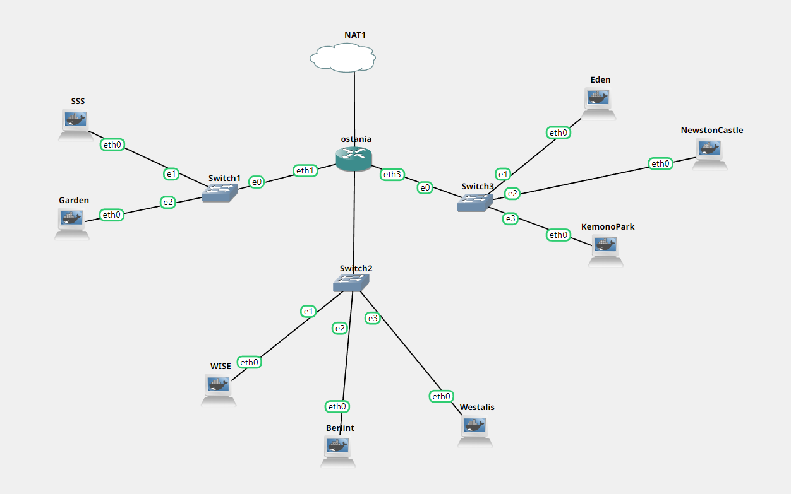

2. Lakukan konfigurasi seperti berikut :

_Konfigurasi untuk ostania_

```
auto eth0
 iface eth0 inet dhcp

auto eth1
iface eth1 inet static
	address 192.217.1.1
	netmask 255.255.255.0

auto eth2
iface eth2 inet static
	address 192.217.2.1
	netmask 255.255.255.0

auto eth3
iface eth3 inet static
	address 192.217.3.1
	netmask 255.255.255.0
```

_Konfigurasi untuk WISE_
```
auto eth0 
iface eth0 inet static 
      address 192.217.2.2
      netmask 255.255.255.0
      gateway 192.217.2.1
```

_Konfigurasi untuk berlint (proxy server)_
```
auto eth0 
iface eth0 inet static 
      address 192.217.2.3
      netmask 255.255.255.0
      gateway 192.217.2.1
```

_Konfigurasi untuk Westalis_ 
```
auto eth0 
iface eth0 inet static 
      address 192.217.2.4
      netmask 255.255.255.0
      gateway 192.217.2.1
```

_Konfigurasi untuk Eden_
```
auto eth0
iface eth0 inet dhcp
hwaddress ether 52:f1:e5:9d:68:fb
```

_Konfigurasi node yang lain_
```
auto eth0
iface eth0 inet dhcp
```
3. Pada WISE sebagai DNS Server, lakukan beberapa perintah berikut:
```
echo "nameserver 192.168.122.1" > /etc/resolv.conf
apt-get update
apt-get install bind9 -y
```
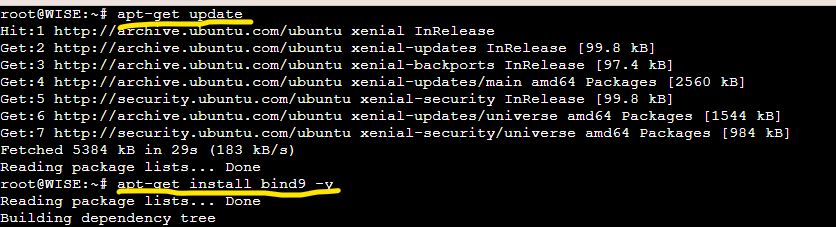

4. Pada Berlint sebagai Proxy Server, lakukan beberapa perintah berikut:
```
echo "nameserver 192.168.122.1" > /etc/resolv.conf
apt-get update
apt-get install libapache2-mod-php7.0 -y
apt-get install squid -y
```
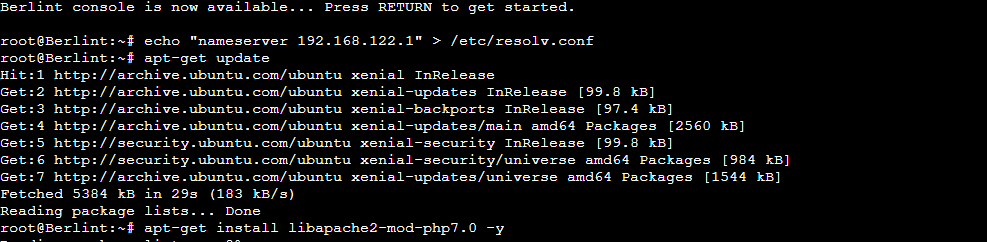

5. Pada Ostania sebagai DHCP Relay, lakukan bebrapa perintah berikut:
```
apt-get update
apt-get install isc-dhcp-relay -y
```
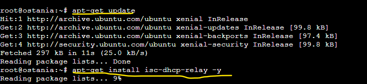
  
**Langkah-langkah Pengerjaan No 2:**  
1. Lakukan updates pada Ostania
2. Menjalankan IPTABLES
3. Download isc-dhcp-relay
4. Jadikan Jipangu (192.217.2.4) sebagai dhcp-server dengan menggunakan interfaces eth1 eth2 eth3.
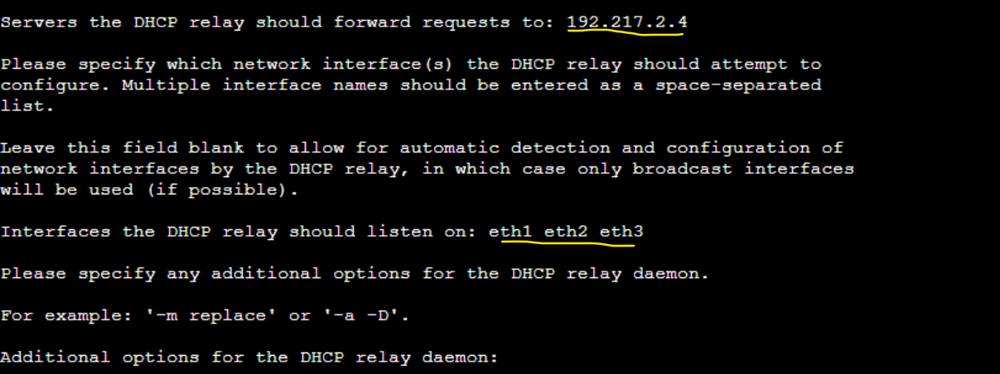

## Soal 3
Client yang melalui Switch1 mendapatkan range IP dari [prefix IP].1.50 - [prefix IP].1.88 dan [prefix IP].1.120 - [prefix IP].1.155

**Langkah-langkah Pengerjaan No 3:**  
1. Lakukan konfigurasi pada Westalis sebagai berikut:
```
echo "nameserver 192.168.122.1" > /etc/resolv.conf
apt-get update -y
apt-get install nano -y
apt-get install isc-dhcp-server -y
```
2. Lakukan konfigurasi DHCP Relay pada Ostania
```
# Defaults for isc-dhcp-relay initscript
# sourced by /etc/init.d/isc-dhcp-relay
# installed at /etc/default/isc-dhcp-relay by the maintainer scripts

#
# This is a POSIX shell fragment
#

# What servers should the DHCP relay forward requests to?
SERVERS="192.217.2.4"

# On what interfaces should the DHCP relay (dhrelay) serve DHCP requests?
INTERFACES="eth1 eth3 eth2"

# Additional options that are passed to the DHCP relay daemon?
OPTIONS=""
```
3. Lakukan konfigurasi DHCP Server pada Westalis
Membuat Jipangu menjadi DHCP Server. Karena Jipangu Terhubung dengan Fosha melalui eth0 sehingga lakukan konfigurasi pada file /etc/default/isc-dhcp-server sebagai berikut:  
```
# Defaults for isc-dhcp-server initscript
# sourced by /etc/init.d/isc-dhcp-server
# installed at /etc/default/isc-dhcp-server by the maintainer scripts

#
# This is a POSIX shell fragment
#

# Path to dhcpd's config file (default: /etc/dhcp/dhcpd.conf).
#DHCPD_CONF=/etc/dhcp/dhcpd.conf

# Path to dhcpd's PID file (default: /var/run/dhcpd.pid).
#DHCPD_PID=/var/run/dhcpd.pid

# Additional options to start dhcpd with.
#       Don't use options -cf or -pf here; use DHCPD_CONF/ DHCPD_PID instead
#OPTIONS=""

# On what interfaces should the DHCP server (dhcpd) serve DHCP requests?
#       Separate multiple interfaces with spaces, e.g. "eth0 eth1".
INTERFACES="eth0"
```
4. Lakukan restart DHCP server dengan `service isc-dhcp-server restart`
5. lakukan konfigurasi untuk rentang IP yang akan diberikan pada file `/etc/dhcp/dhcpd.conf` dengan cara :
```
subnet 192.217.1.0 netmask 255.255.255.0 {
   range 192.217.1.20 192.217.1.99;
   range 192.217.1.150 192.217.1.169; 
   option routers 192.217.1.1;
   option broadcast-address 192.217.1.255;
   option domain-name-servers 192.217.2.2;
   default-lease-time 360;
   max-lease-time 7200;
}
```

## Soal 4
Client yang melalui Switch3 mendapatkan range IP dari [prefix IP].3.10 - [prefix IP].3.30 dan [prefix IP].3.60 - [prefix IP].3.85

**Langkah-langkah Pengerjaan No 4:**  
1. Lakukan konfigurasi untuk rentang IP yang akan diberikan pada file /etc/dhcp/dhcpd.conf dengan cara menambahkan konfigurasi berikut ini:
```
subnet 192.217.1.0 netmask 255.255.255.0 {
    range  192.217.1.50 192.217.1.88;
    range  192.217.1.120 192.217.1.155;
    option routers 192.217.1.1;
    option broadcast-address 192.217.1.255;
    option domain-name-servers 192.217.2.2;
    default-lease-time 300;
    max-lease-time 6900;
}
```
Dengan begitu kita telah menentukan ip range dengan menambahkan range 192.217.1.50 192.217.1.88; pada subnet interface switch 3 yang terhubung ke fosha pada eth3.

## Soal 5
Client mendapatkan DNS dari WISE dan client dapat terhubung dengan internet melalui DNS tersebut.  
  
**Langkah-langkah Pengerjaan No 5:**  
1. Untuk client mendapatkan DNS dari EniesLobby diperlukan konfigurasi pada file `/etc/dhcp/dhcpd.conf`
2. Supaya semua client dapat terhubung internet pada EniesLobby diberikan konfigurasi pada file `/etc/bind/named.conf.options` dengan:
```
options {
        directory \"/var/cache/bind\";
        forwarders {
                8.8.8.8;
                8.8.8.4;
        };
        // dnssec-validation auto;
        allow-query { any; };
        auth-nxdomain no;    # conform to RFC1035
        listen-on-v6 { any; };
};
```
  
**Testing**
Dengan mengkonfigurasi DHCP server dan DHCP Relay seluruh Client yang berada pada subnet interface switch 1 dan switch 3 akan otomatis mendapatkan IP pada rentang yang telah dikonfigurasi. Untuk contohnya adalah sebagai berikut:
  
_SSS_  
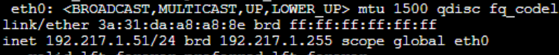  
inet 192.217.1.51/24
  
_Garden_  
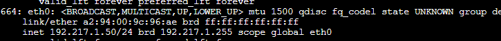  
inet 192.217.1.50/24
  
_Eden_  
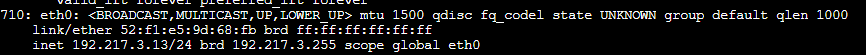  
inet 192.217.3.13/24
  
_NewstonCastle_  
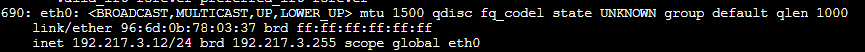  
inet 192.217.3.12/24
  
_KemonoPark_  
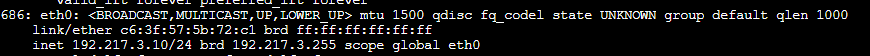  
inet 192.217.3.10/24
  
Memastikan semua Client dapat terhubung ke Internet:  
_SSS_ 
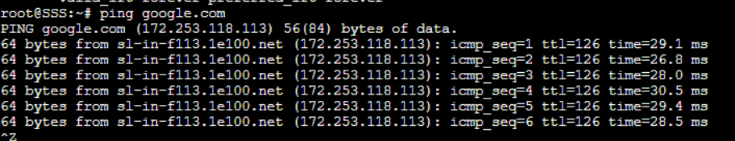  
  
_Garden_  
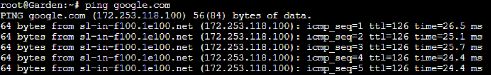  
  
_NewstonCastle_  
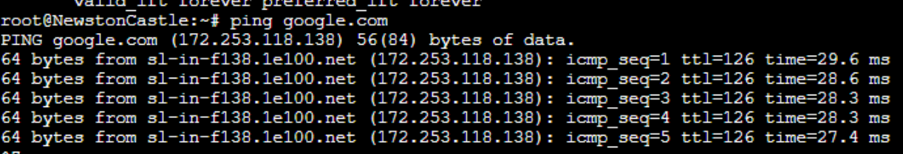 
  
_KemonoPark_  
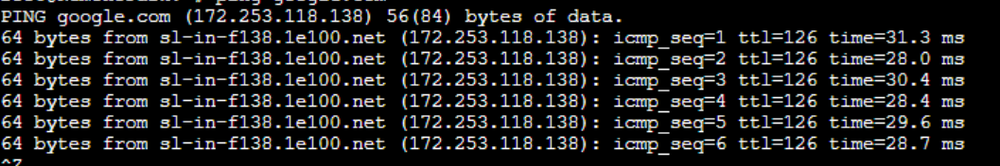  
  
_Eden_  
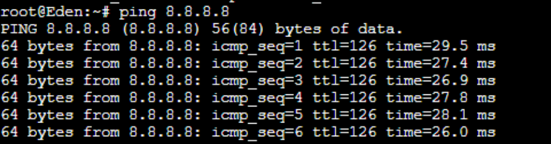  

## Soal 6
Lama waktu DHCP server meminjamkan alamat IP kepada Client yang melalui Switch1 selama 5 menit sedangkan pada client yang melalui Switch3 selama 10 menit. Dengan waktu maksimal yang dialokasikan untuk peminjaman alamat IP selama 115 menit.

**Langkah-langkah Pengerjaan No 6:**
1. Pada subnet interface switch 1 dan 3 ditambahkan konfigurasi berikut pada file `/etc/dhcp/dhcpd.conf`  
```
subnet 192.217.1.0 netmask 255.255.255.0 {
    range  192.217.1.50 192.217.1.88;
    range  192.217.1.120 192.217.1.155;
    option routers 192.217.1.1;
    option broadcast-address 192.217.1.255;
    option domain-name-servers 192.217.2.2;
    default-lease-time 300;
    max-lease-time 6900;
}

subnet 192.217.3.0 netmask 255.255.255.0 {
    range  192.217.3.10 192.217.3.30;
    range  192.217.3.60 192.217.3.85;
    option routers 192.217.3.1;
    option broadcast-address 192.217.3.255;
    option domain-name-servers 192.217.2.2;
    default-lease-time 600;
    max-lease-time 6900;
}
```

## Soal 7
Loid dan Franky berencana menjadikan Eden sebagai server untuk pertukaran informasi dengan alamat IP yang tetap dengan IP [prefix IP].3.13

**Langkah-langkah Pengerjaan No 7:**
1. Tambahkan konfigurasi untuk fixed address pada `/etc/dhcp/dhcpd.conf`
```
host Eden {
    hardware ethernet 52:f1:e5:9d:68:fb;
    fixed-address 192.217.3.13;
}
```
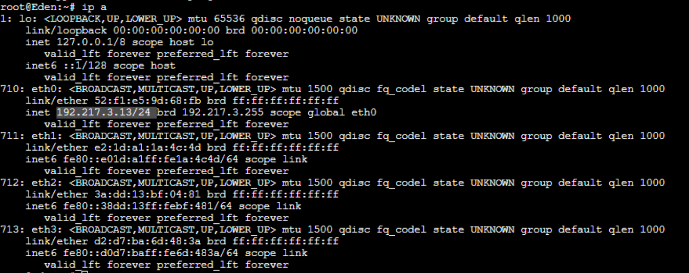

## Soal 7
Pada Proxy Server di Berlint, Loid berencana untuk mengatur bagaimana Client dapat mengakses internet. Artinya setiap client harus menggunakan Berlint sebagai HTTP & HTTPS proxy. Adapun kriteria pengaturannya adalah sebagai berikut:  
- Client hanya dapat mengakses internet diluar (selain) hari & jam kerja (senin-jumat 08.00 - 17.00) dan hari libur (dapat mengakses 24 jam penuh)  
  
**Langkah-langkah Pengerjaan No 8:**  
1. Pada Berlint sebagai proxy server, lakukan konfigurasi pada `/etc/squid/acl.conf` dengan seperti berikut:
```
acl AVAILABLE_WORKING time MTWHF 00:00-08:00
acl AVAILABLE_WORKING time MTWHF 17:00-23:59
acl AVAILABLE_WORKING time AS 00:00-23:59 
```
2. Lanjutkan melakukan konfigurasi pada `nano /etc/squid/squid.conf` dengan seperti berikut:
```
include /etc/squid/acl.conf
http_port 8080
http_access allow AVAILABLE_WORKING
http_access deny all
visible_hostname Berlint
```
3. Lakukan restart squid dengan menggunakan perintah: `service squid restart`  

**Melakukan Testing Pada Client**
